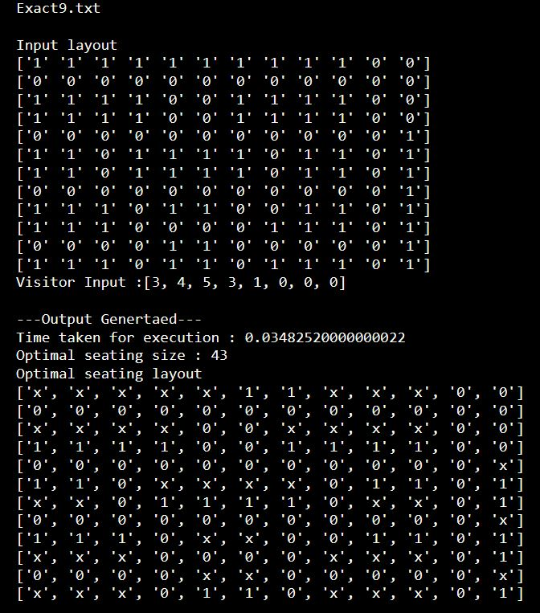

# Optimal-socially-distanced-movie-seating-arrangement
Offline decision support algorithm for 'strict' socially distanced movie seating arrangement with a goal to maximize the number of groups/people seated in a given movie layout

1 - represnts available seat

0 - represents no seat/blocked seat due to social distancing

x - occupied seat

Visitor input -> array of number of groups(1-8) arriving at a cinema
# Social Distance criterion
1sss1

ssxss

1sss1

s - represents the seats blocked due to occupied seat x in a 3x5 grid

# Test Instance
  

